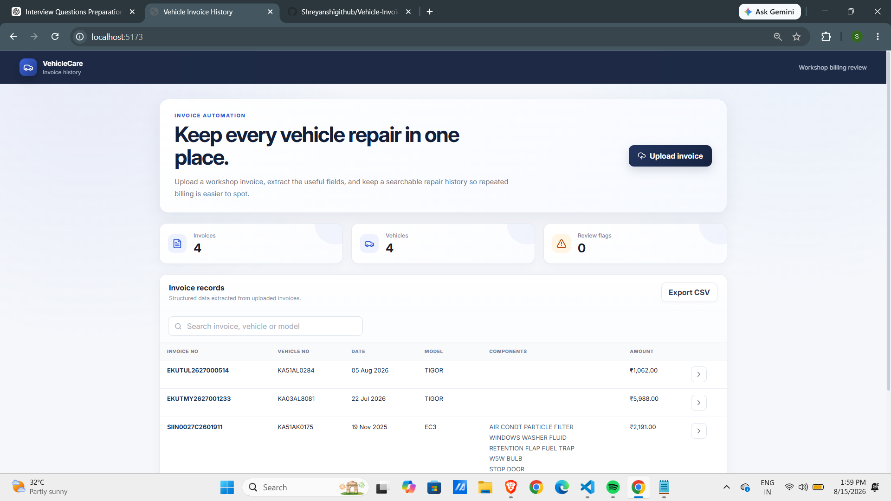
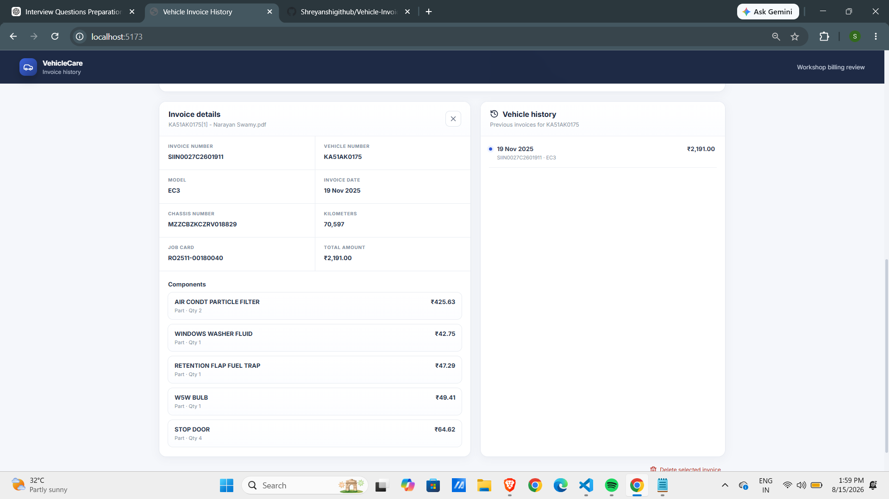
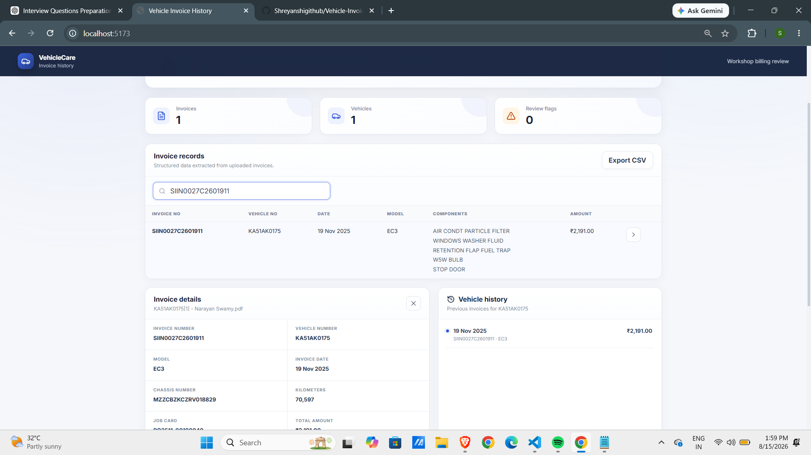

# Vehicle Invoice History — Full Stack Assessment Project

This is a focused MVP for the invoice-automation requirement discussed in the interview.

## What it does

1. Upload a workshop invoice as PDF or image.
2. Extract text automatically (PDF text extraction or Tesseract OCR for images).
3. Map the document into structured fields: invoice number, registration number, model, chassis number, date, kilometres and line items.
4. Store the normalized record in MongoDB.
5. Show the records in an Excel-like table and export CSV.
6. Open a vehicle's repair history.
7. Flag repeated components in the same vehicle history for manual review.

The system intentionally says **flag/review**, not **fraud**, because repeated work can have a genuine reason.

## Tech stack

- Frontend: React + Vite
- Backend: Node.js + Express
- Database: MongoDB + Mongoose
- PDF extraction: pdf-parse
- Image OCR: Tesseract.js

## Run locally

### 1. Start MongoDB
Use a local MongoDB instance or a MongoDB Atlas connection string.

### 2. Backend

```bash
cd backend
npm install
copy .env.example .env
npm run dev
```

On macOS/Linux use `cp .env.example .env`.

### 3. Frontend

```bash
cd frontend
npm install
npm run dev
```

Open http://localhost:5173.

## Demo invoice

`sample-invoices/` contains the invoice supplied for the assessment. It is a text-based PDF, so the demo uses the PDF extraction path. The parser is deliberately kept as a small, readable service instead of hiding the business logic in a large framework.

## Screenshots

### Dashboard



### Vehicle Invoice History Details



### Search Filter



## Production improvements I would discuss in an interview

- Replace the local OCR adapter with AWS Textract / Google Document AI for more varied invoice formats.
- Add a confidence score and manual review for low-confidence extraction.
- Make invoice processing asynchronous with a queue for large documents.
- Store the original document in object storage such as S3 rather than the application server.
- Add authentication, role-based access, audit logs and rate limiting.
- Use stronger format-specific parsers/configuration as new workshop formats are onboarded.
- Add a proper anomaly-scoring/rules service rather than a simple 30-day repeated-component rule.
